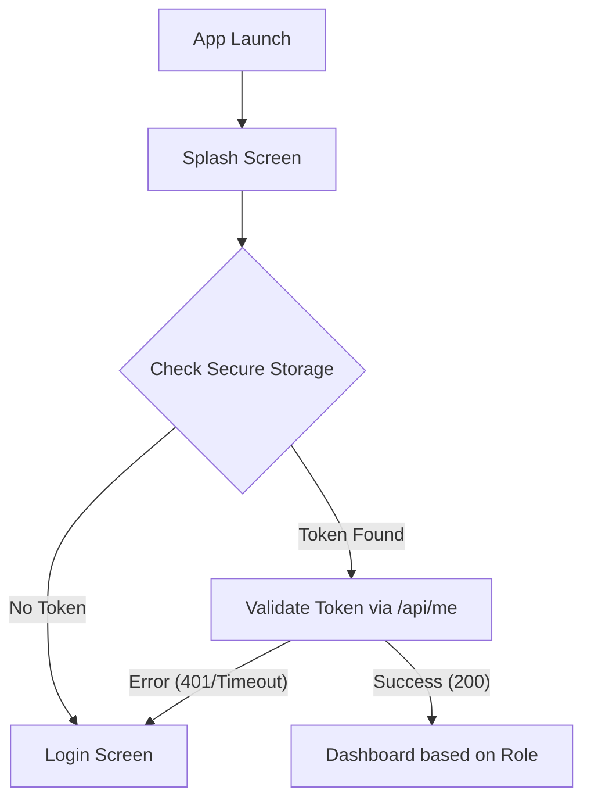
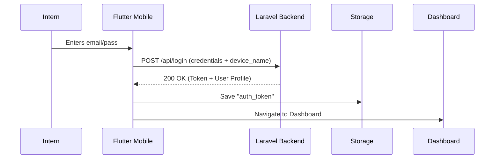

# Mobile Authentication Contract - Phase 2C

This document serves as the technical specification for the handoff between the Laravel Backend and the Flutter Mobile Application.

## 1. Login Request
**Endpoint:** `POST /api/login`  
**Public:** Yes

### Request Body
```json
{
  "email": "intern@bjuka.io",
  "password": "password",
  "device_name": "iPhone 15 Pro"
}
```

### Validation Rules
- `email`: Required, valid email format.
- `password`: Required.
- `device_name`: Required (used to label the Sanctum token).

---

## 2. Login Response
**Status:** `200 OK`

### JSON Structure
```json
{
  "token": "1|abc123tokenValue...",
  "user": {
    "id": 12, 
    "name": "John Doe",
    "email": "intern@bjuka.io",
    "role": "intern"
  }
}
```
*Note: `user.id` is an **Integer** (as established in Phase 1 for the existing `users` table).*

### Role-Based Routing Intent
Current mobile login is **intern-only**.

The backend only returns `200 OK` from `/api/login` when:
- the authenticated user has `role = intern`
- the user has a related `Intern` profile
- that `Intern` profile has `status = active`

Flutter should currently route successful mobile logins to:
- `intern` ➔ Navigate to `InternDashboard`

Supervisor/admin mobile dashboards are future scope. Until that backend support is added, supervisor/admin users receive `403 Forbidden` from `/api/login`.

---

## 3. Logout Request
**Endpoint:** `POST /api/logout`  
**Authentication:** Required (Bearer Token)

### Headers
```yaml
Authorization: Bearer {token}
Accept: application/json
```

### Response
**Status:** `200 OK`
```json
{
  "message": "Successfully logged out"
}
```

---

## 4. Current User Request (/me)
**Endpoint:** `GET /api/me`  
**Authentication:** Required (Bearer Token)

### Response Structure
**Status:** `200 OK`
```json
{
  "user": {
    "id": 12,
    "name": "John Doe",
    "email": "intern@bjuka.io",
    "role": "intern"
  }
}
```

---

## 5. Error Responses

### Invalid Credentials
**Status:** `422 Unprocessable Entity`
```json
{
  "message": "The given data was invalid.",
  "errors": {
    "email": ["These credentials do not match our records."]
  }
}
```

### Inactive Account
**Status:** `403 Forbidden`
```json
{
  "message": "Account is deactivated. Please contact your supervisor."
}
```

This response is returned when the user has `role = intern` but does not have an active related `Intern` profile.

### Non-Intern Mobile Login
**Status:** `403 Forbidden`
```json
{
  "message": "Unauthorized. Only interns can log in to the mobile app."
}
```

### Unauthorized / Expired Token
**Status:** `401 Unauthorized`
```json
{
  "message": "Unauthenticated."
}
```

### Validation Failures
**Status:** `422 Unprocessable Entity`
```json
{
  "message": "The device name field is required.",
  "errors": {
    "device_name": ["The device name field is required."]
  }
}
```

### Network & Infrastructure Failures (Client-Side Simulated)
If the backend is unreachable, Flutter should catch the exception and display/process a standardized message:
**No Internet / Server Unreachable / Timeout**
```json
{
  "message": "Unable to connect to server. Please check your internet connection."
}
```

---

## 6. Token Storage Strategy (Flutter)

### Storage Choice
- Use `flutter_secure_storage` for all platforms (iOS Keychain / Android Keystore).

### Key Management
- **Save Token:** Upon `200 OK` from `/api/login`, save `token` string to secure storage.
- **Restore Session:** On App Launch, check if `token` exists in secure storage.
- **Unauthorized Handler:** If any API call returns `401 Unauthorized`, the app MUST wipe the local token and redirect the user to the Login screen.
- **Local Logout:** Upon successful `/api/logout` call, wipe the token from secure storage immediately.

---

## 7. Authentication Sequence Diagrams

### App Launch & Startup States


### Login Flow

